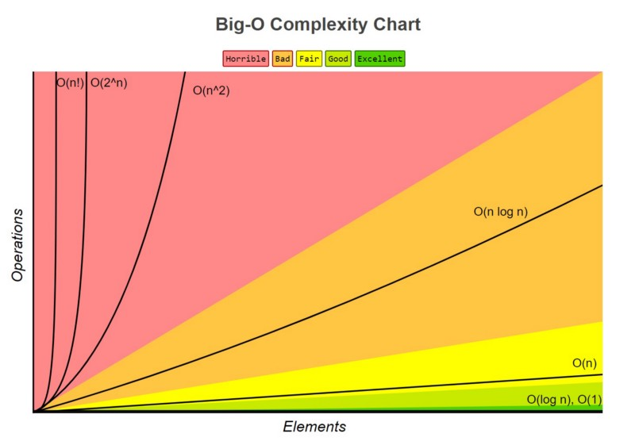

# What is asymptotic notation ? 
Asymptotic notation describes the behavior of an algorithm's running time or space usage as the input size grows towards infinity.

# Why do we use it ? 
1. to Compare alogrithms independently of hardware or implementation
2. to check the performance like best , average and worst
3. To understand scalability

# What is asymptotic notation ?

It describes behavior of algorithms's running time or space usage as input size grows 

mathmatical tool to represent growth or performance 

types  :
1. Big - O -- used to represent upper bound or worst case technically complexity(generally most people use Big O notation for every case) 

2. Big - Omega -- used to represent lower bound or best case complexity

3. Big - Theta -- represent tight bound (average case) between upper and lower bound

example :- O(n) , Ω(1) , θ(n)

Then , there is order of growth concept which gives graph to get the performance idea

example. constant , linear, quadratic , logarithmic

